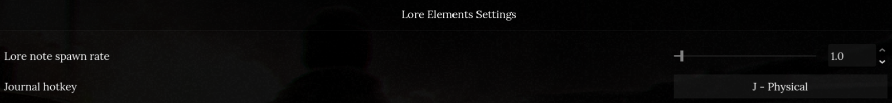
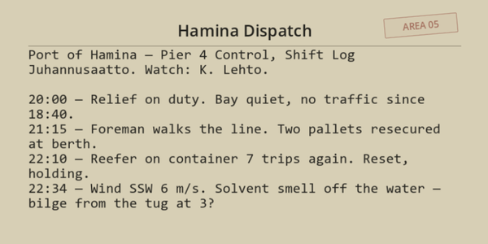
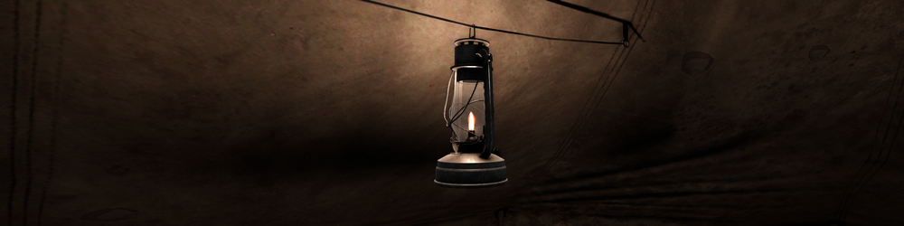

# Lore Elements

Readable notes and environmental storytelling for **Road to Vostok**.

Lore Elements adds discoverable notes, letters, reports, lists, and map fragments to existing loot. Each note can be read in a styled multi-page reader, saved into a persistent journal, and, for selected notes, shown as a discovered pin on the in-game map.

## Requirements

- Road to Vostok, current public build
- Metro Mod Loader `v3.1.1` or newer
- Mod Configuration Menu is optional but recommended

## Install

1. Download `rtv_lore_elements.vmz` from GitHub Releases or ModWorkshop.
2. Drop the `.vmz` file into the Road to Vostok `mods` folder.
3. Launch the game through the Metro-enabled setup.

In Developer Mode the loader can also read loose mod folders, but packaged releases should keep `mod.txt` at archive root and the source files under `rtv-lore-elements/`.

## Usage

- Find lore notes through normal loot.
- Right-click a note and choose `Read` to open the reader.
- Use `Prev`, `Next`, `Close`, or Escape/settings to navigate and close notes.
- Press `J` by default to open the journal and re-read discovered notes.
- Some discovered notes add pins to the in-game map.

## Configuration

With Mod Configuration Menu installed, open the `Lore Elements` page to configure:

- `Lore note spawn rate`: multiplies how often lore notes appear in newly generated loot.
- `Journal hotkey`: changes the key bound to the persistent journal.

## Media

## Links

- Source: <https://github.com/manova/rtv-lore-elements>
- Releases: <https://github.com/manova/rtv-lore-elements/releases>
- Changelog: [CHANGELOG.md](CHANGELOG.md)
- <!-- MODWORKSHOP_LINK --> ModWorkshop link coming with v0.1.0 release — see Releases.

## Contributing

Bug reports and small fixes are welcome. Please read [CONTRIBUTING.md](CONTRIBUTING.md) before opening an issue or pull request. Lore/content changes are curated for tone and should start with an issue before a PR.

## License

Code, tooling, manifests, JSON schemas/configuration, and implementation documentation are licensed under the MIT License. See [LICENSE](LICENSE).

Authored lore/content is licensed under Creative Commons Attribution 4.0 International. See [LICENSE-CONTENT](LICENSE-CONTENT). This content license covers `data/notes.json`, user-facing strings in `data/strings/en.json`, and lore note text/name content in `Items/Lore/Notes/*.tres`.

Road to Vostok and original Road to Vostok assets are copyright Plumato Games. Lore Elements does not redistribute copied RtV textures, sounds, or models; it references vanilla game resources at runtime and includes screenshots captured in-game for presentation.

Bundled font: Caveat Regular by the Caveat Project Authors, licensed under SIL Open Font License 1.1. See [assets/fonts/OFL.txt](assets/fonts/OFL.txt).
